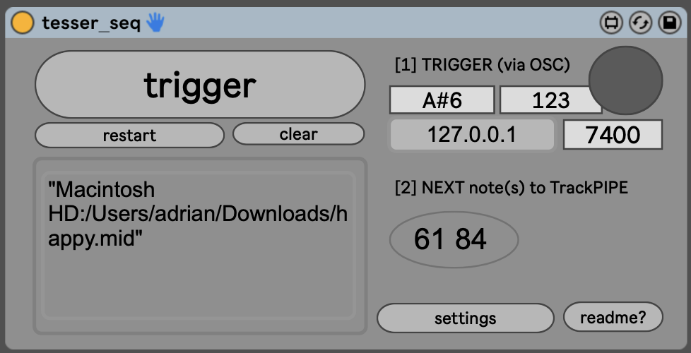

# Tesser_seq

The goal of this device is to allow the performer to recall notes stores in midi files in different ways.

---

---

## Setup

---

## MODES

### Simple mode: note by note

When the performer hits a note (notes off messages are filtered), two things happen in rapid succession:

* A trigger note is send via OSC to a `tesser_pipe` device, which feeds it to an instance of **Synced pitch trigger V1**.

* Inmediately after, ticks are send to the [seq] object until a new, non note-off message is found. That will be sent by the device as midiout. This should be piped to the **Synced pitch trigger V1** device using a **Send MIDI notes via pipe** device.

This way, **Synced pitch trigger V1** receives two streams: one triggers last fed note, and the other feeds the next note to be triggered.

---

## Multitrack tricks

You can store different instruments in different ranges of the midi file.

Use [tesser_split](https://bitbucket.org/AdrianArtacho/tesser_split) to split midi above/below a pitch value.

Use [tesser_hold](https://bitbucket.org/AdrianArtacho/tesser_hold) to ignore notes off and hold the notes so long as needed. 
In order to then stop the held notes, you need to pass the note witha a vel = 1 (pseudo note off)

The first notes (0-24) should be used for DMX stuff

The last 121-127 could encode the splits/octaves information

---

## Restart via CC

You may use a custom CC number to restart the sequence at a given point

## Loading midi files

1. Drag and drop (the container folder will be extracted)
2. Once the container folder is set, the filename (without extension) will suffice to load the file.
---

## To-Do

* Restart via CC: (different possible behaviours?): forward-restart, forward-backward... etc. (settable via CC)

* That, on loading, restart and flush (reload from the path stored in a textedit)

* Allow for (gate/trigger) behaviours for midi notes entering (and >> pipe)

* Add link to midifiles repo (sub README)
* Add a link to pass the commands: commit, push... etc. from the shell to the midifiles instance.
* Larger textedit for the extracted path-to-midifiles
* Button on GUI to open that folder in finder
* ISSUE with finding the files!

